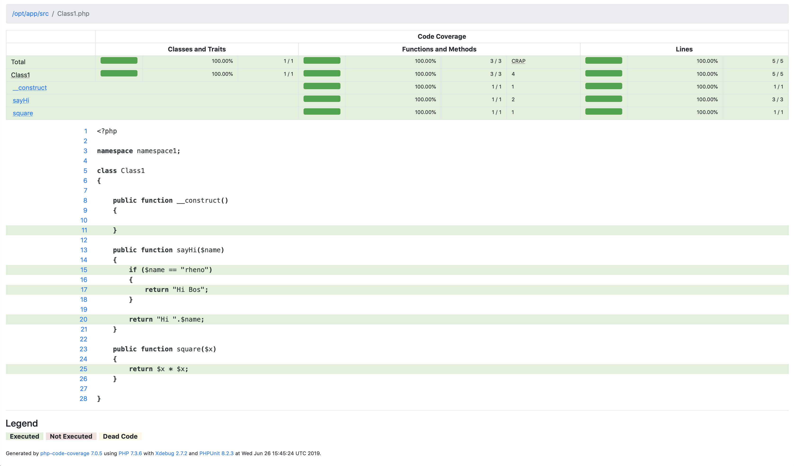

# docker-phpunit

### How to run :

1. `docker build -t docker-phpunit .`

2. `docker run -it --rm --name php-test -v "$PWD":/opt/app docker-phpunit`

3. `composer install`

4. `vendor/bin/phpunit`

5. Screenshot :

